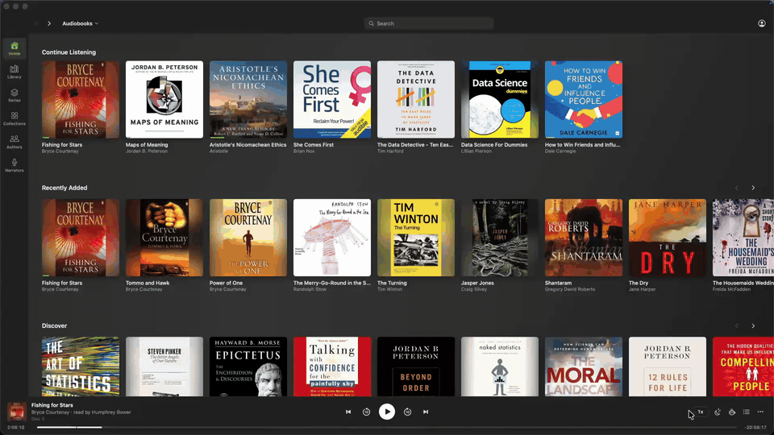
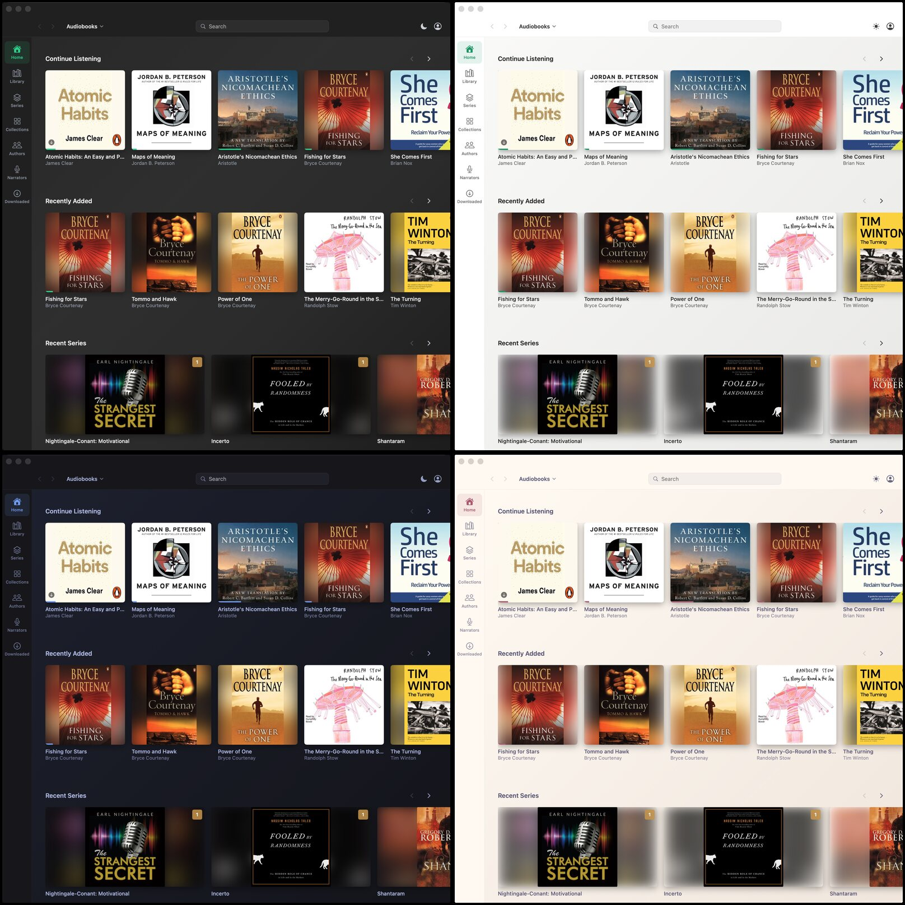

# Audiobookshelf for macOS (unofficial)

[](https://github.com/arturgrochau/audiobookshelf-mac/actions/workflows/ci.yml) [](https://github.com/arturgrochau/audiobookshelf-mac/releases) [](LICENSE)

A native Mac client for [Audiobookshelf](https://github.com/advplyr/audiobookshelf). It looks and works like the web client, with the same pages, player controls and wording, but plays audio through AVFoundation and feels like a Mac app.



<sub>19 seconds, sped up 1.25x. [MP4 version](docs/demo.mp4).</sub>

## Listening

- Playback keeps going when the window is closed. Media keys, Now Playing and AirPods controls work.
- Multi-file books play gaplessly, straight from the server.
- Downloaded books play from disk. If a book finishes downloading while you listen, playback moves to the local copy at the next pause or file boundary, or right away if the stream stalls. You hear no cut.
- Progress syncs on the web client's schedule, so the web and phone apps pick up where you stopped.
- Speed presets, a fine step, and quick keys: `S` 2x, `A` 1.5x, `X` 1.2x, `Z` back to 1x.
- Sleep timer with a gentle fade, including end of chapter.
- Mini player (`⌘⇧M`): a small floating panel with the book, play/pause, jumps and speed. It stays on top across Spaces and full-screen apps without stealing focus. Hover it to set how see-through it is when the pointer is away.
- Keep awake (☕): the Mac stays awake while a book plays. With a one-time permission it keeps playing with the lid closed too, and gives sleep back the moment playback stops, the sleep timer fires, or the battery drops under 20%.
- Books can be downloaded for offline listening. Offline sessions are uploaded when you're back online.
- You stay logged in: tokens refresh on their own.

## Themes

The sun/moon button in the top right flips between light and dark (`⌥⌘L`). Right-click it, or open Settings, for every theme: Audiobookshelf (the web client's colours), Light, Space (Tokyo Night), Nord, Catppuccin, Latte and Princess (Rosé Pine Dawn). "Match system appearance" follows macOS light and dark mode.



## Keys

| Key | Action |
|---|---|
| Space | Play / pause |
| ← / → | Jump back / forward |
| ⌘← / ⌘→ | Previous / next chapter |
| ↑ / ↓ | Volume |
| ⇧↑ / ⇧↓ | Speed step |
| S · A · X · Z | 2x · 1.5x · 1.2x · 1x |
| M | Mute |
| L | Chapters |
| ⌘⇧M | Mini player |
| ⌥⌘L | Light / dark |
| ⌘1 to ⌘7 | Home, Library, Series, Collections, Playlists, Authors, Narrators |

It's not affiliated with the Audiobookshelf project. Tested against server 2.36.

## Build

Needs macOS 15 or later and the Xcode Command Line Tools.

```sh
./build.sh   # builds and installs ~/Applications/Audiobookshelf.app
./test.sh    # unit tests
```

Set `SIGN_IDENTITY` to a code-signing identity (a self-signed one is fine) if you want the Local Network permission to survive rebuilds.

The lid-closed option installs one sudoers rule, `/etc/sudoers.d/audiobookshelf-lid`, that allows only `pmset -a disablesleep 0|1`. Remove that file to undo it. If lid sleep ever stays off after a crash or power loss, the next launch restores it, or run `sudo pmset -a disablesleep 0`.

What changed in each version: [CHANGELOG.md](CHANGELOG.md).

## License

GPL-3.0, like Audiobookshelf itself. See `LICENSE` and `NOTICE` for the bundled fonts and strings.
